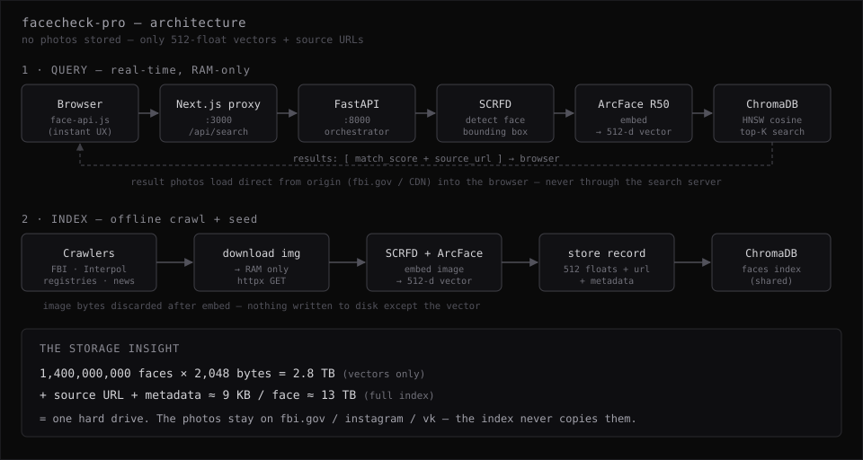

# FaceCheck Pro


A working reconstruction of how a face-recognition search engine (à la FaceCheck.id) is built — from public numbers and off-the-shelf models. Upload a photo, get back matching profiles with source URLs, metadata, and confidence scores.

The point isn't the 252 faces in the demo index. It's the architecture: **client-side face detection → 512-dim ArcFace embedding → cosine-similarity vector search → matches with source URLs** — the same shape every embedding-based face search engine runs, from PimEyes to Clearview.

## How It Works



Two paths share one ChromaDB vector store:

- **Query (real-time, RAM-only):** `upload → SCRFD detect → ArcFace embed (512-d) → HNSW cosine search → top-K + source URLs`. The uploaded photo is decoded in memory, turned into a vector, and garbage-collected. Result photos load directly from their origin servers (fbi.gov, CDNs) into your browser — they never pass through the search server.
- **Index (offline crawl + seed):** `crawlers → download to RAM → embed → store [512 floats + URL + metadata]`. The image bytes are discarded after embedding.

**Nothing is stored on disk except the vectors and URLs** (512 floats = 2 KB per face). This is the whole trick: 1.4 billion faces is ~2.8 TB of vectors (≈13 TB with metadata) — one hard drive, not a photo warehouse. The photos stay where they already live.

## Tech Stack

| Layer | Technology |
|---|---|
| **Frontend** | Next.js 16, React 19, Tailwind CSS, face-api.js |
| **Backend** | FastAPI, InsightFace (buffalo_l), ONNX Runtime |
| **Detection** | SCRFD 10g (server) + TinyFaceDetector (browser fallback) |
| **Recognition** | ArcFace ResNet50 → 512-dim L2-normalized embeddings |
| **Vector DB** | ChromaDB with HNSW cosine similarity |
| **Crawlers** | FBI Wanted API, Interpol Red Notices, state registries, social media |

## Quick Start

### 1. Start the Python backend

```bash
cd backend
bash run.sh
# Starts on http://localhost:8000
# Downloads InsightFace models (~630MB) on first run
# Seeds ChromaDB with FBI wanted persons
```

### 2. Start the Next.js frontend

```bash
npm install
npm run dev
# Starts on http://localhost:3000
```

### 3. Search

Open `http://localhost:3000`, upload a face photo, and click Search.

## Project Structure

```
facecheck-pro/
├── src/
│   ├── app/
│   │   ├── page.tsx                  # Landing page
│   │   ├── search/page.tsx           # Search UI + results + detail modal
│   │   └── api/search/route.ts       # Next.js → FastAPI proxy
│   └── lib/
│       ├── face-detection.ts         # Browser-side face-api.js wrapper
│       └── utils.ts
├── public/models/                    # face-api.js weights (tiny, ~7MB)
├── backend/
│   ├── api/main.py                   # FastAPI server — search, seed, FaceCheck.id API
│   ├── engine/
│   │   ├── face_embedder.py          # InsightFace wrapper (SCRFD + ArcFace)
│   │   └── vector_store.py           # ChromaDB wrapper (HNSW cosine search)
│   ├── crawlers/
│   │   ├── fbi_wanted.py             # FBI Wanted API (free, no key)
│   │   ├── sex_offender_registries.py # NSOPW.gov + state registries
│   │   ├── social_media.py           # Public profile image search
│   │   ├── scammers.py               # Scam-forum face photos
│   │   ├── news_media.py             # GDELT + RSS news images
│   │   ├── jailbase.py               # County mugshot crawler
│   │   └── videos_youtube.py         # YouTube thumbnail crawler
│   └── data/
│       ├── chroma/                   # ChromaDB (2MB vector index, gitignored)
│       └── models/                   # InsightFace ONNX (~630MB, gitignored)
└── README.md
```

## API Endpoints

| Method | Path | Description |
|---|---|---|
| `POST` | `/api/search` | Upload image, search faces |
| `POST` | `/api/search-url` | Search from image URL |
| `GET`  | `/api/stats` | Database statistics |
| `POST` | `/api/seed?source=fbi&max_per_source=50` | Seed database from crawlers |
| `POST` | `/api/admin/clear` | Clear database |
| `POST` | `/api/facecheck/upload` | FaceCheck.id compatible upload |
| `POST` | `/api/facecheck/search` | FaceCheck.id compatible search |

## Data Storage

Each face in the database = **~9KB** total:

| Field | Size | Description |
|---|---|---|
| Embedding | 2KB | 512 float32 values (face fingerprint) |
| Source URL | ~150B | Link to FBI profile page |
| Thumbnail URL | ~150B | Link to image on FBI servers |
| Metadata | ~6KB | Name, crimes, reward, physical description |

**Zero image storage.** Photos are never saved to disk — only embeddings and URLs. This is the same architecture FaceCheck.id uses at billion-face scale.

## Architecture Decisions

- **Why two face detectors?** Browser-side face-api.js gives instant feedback ("face detected"). Server-side InsightFace SCRFD is far more accurate for actual matching.
- **Why RAM-only?** FaceCheck.id doesn't store 1.4B photos — neither do we. Download → embed → discard. The vector IS the storage.
- **Why ChromaDB?** HNSW cosine similarity on SQLite. Good to ~1M faces. At billion scale you'd swap to FAISS/Milvus with IVF-PQ sharding.
- **Why 512-dim embeddings?** ArcFace R50 produces L2-normalized 512-dim vectors. Cosine similarity between these is what makes face matching work.

## Limitations vs FaceCheck.id

| | This Project | FaceCheck.id |
|---|---|---|
| Faces indexed | 252 (FBI + test) | ~1.4 billion |
| Sources | 1 working (FBI API) | 50+ production crawlers |
| Crawler infra | Single requests, no proxies | Rotating IPs, headless browsers, 24/7 fleet |
| Vector DB scale | SQLite (single machine) | Sharded FAISS/Milvus across 100s of machines |
| Image storage | None (RAM-only) | None (RAM-only + CDN cache) |

## Ethics & scope

This is an educational reconstruction, published to explain how commercial face-search
engines actually work — the same reason researchers dissect PimEyes and Clearview in public.

- The demo index holds **252 faces**, seeded almost entirely from the **FBI Wanted** and
  **Interpol Red Notice** public APIs (government data, published for identification) plus
  a handful of **synthetic** faces (`randomuser.me`, `dicebear`) for testing.
- The crawlers only touch **public** endpoints and identify themselves with a research
  User-Agent. There is no proxy rotation, no CAPTCHA-solving, no anti-bot evasion — against
  real platforms they get rate-limited and stop. That's the point: the hard part of a
  billion-face index is crawling infrastructure, and this repo deliberately doesn't build it.
- **No private individuals' data ships in this repo.** Scraped images, the vector DB, and
  uploads are all git-ignored. Don't point this at people who haven't consented, and don't
  use it to identify, track, or harass anyone. Face search is a serious privacy hazard —
  understand it so you can defend against it, not weaponize it.

## License

[MIT](LICENSE) — Copyright (c) 2026 shellcat
